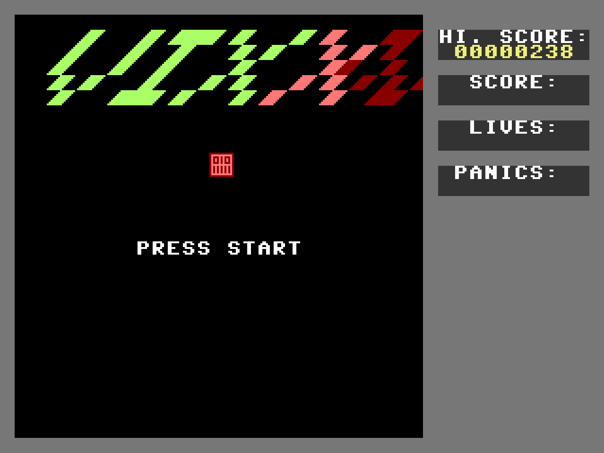

[](https://www.commanderx16.com/forum/index.php?/topic/974-devlog-vixx-bullet-hell-game/)
[](https://www.commanderx16.com/forum/index.php?/files/file/135-vixx/)
[](https://www.commanderx16.com/emulator/x16emu.html?manifest=/emulator/135-vixx/)

# Vixx

A Bullet-Hell game for the Commander X16



*Your Commander X16 got a virus ! Thankfully you have an antivirus called Vix that'll get rid of the evil software.
You play as the Vix Antivirus, scanning the computer trying to locate and destroy the virus.*

# Assembling the game

Download ACME Cross Assembler : https://sourceforge.net/projects/acme-crossass/

Install it on your filesystem, and then run :

```shell
acme -f cbm -o vixx.prg main.asm
```
